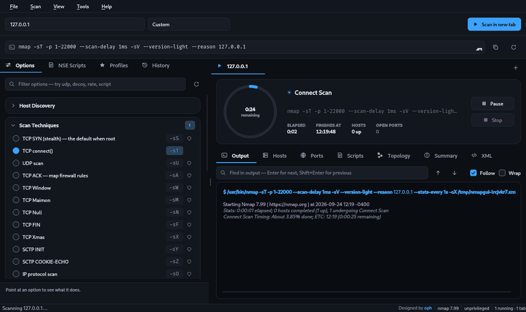
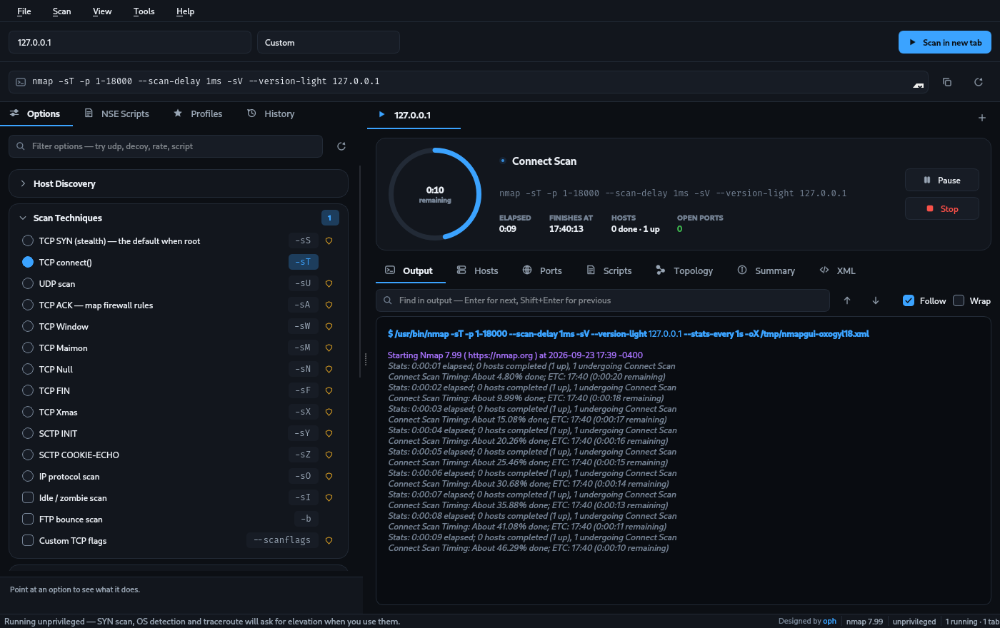
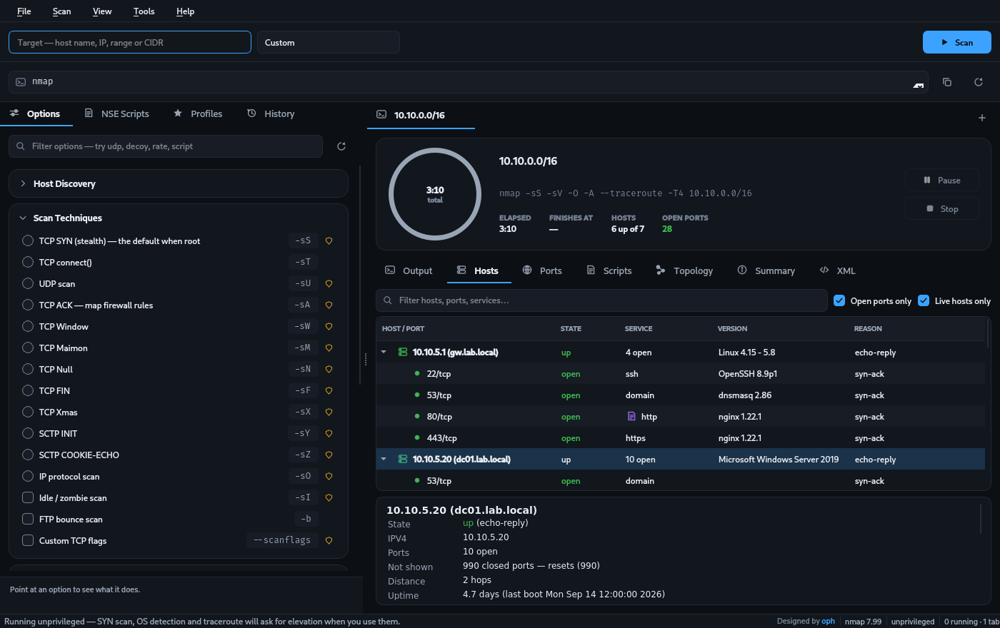
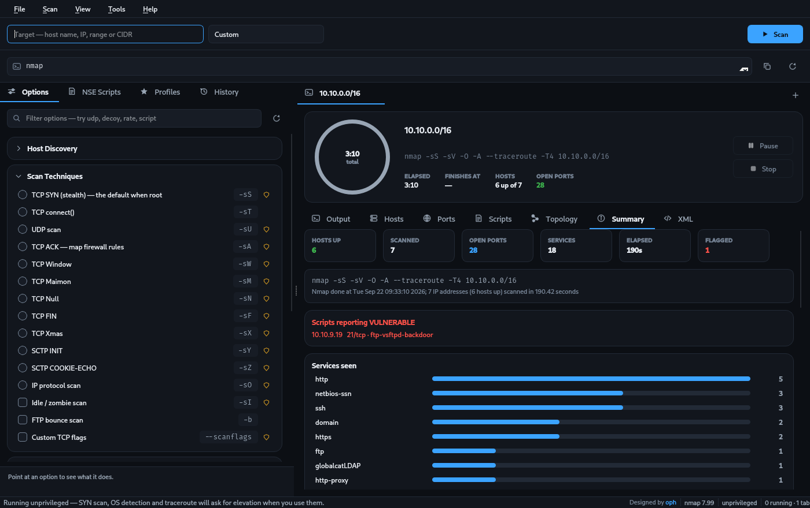
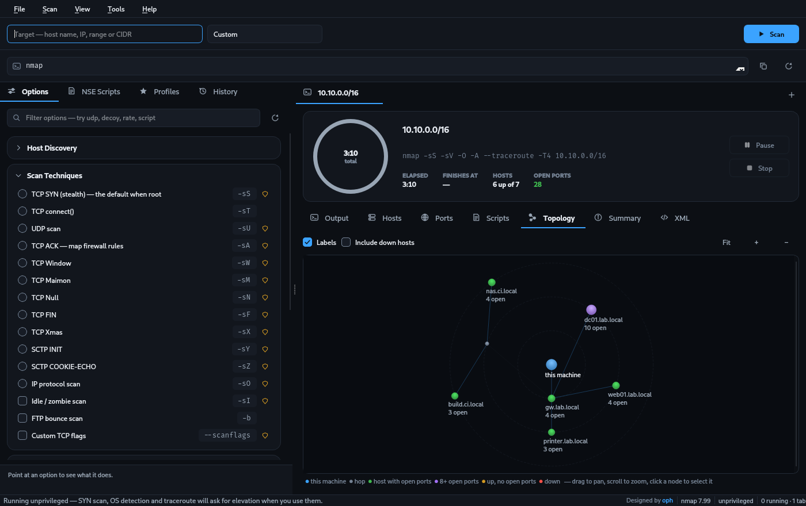
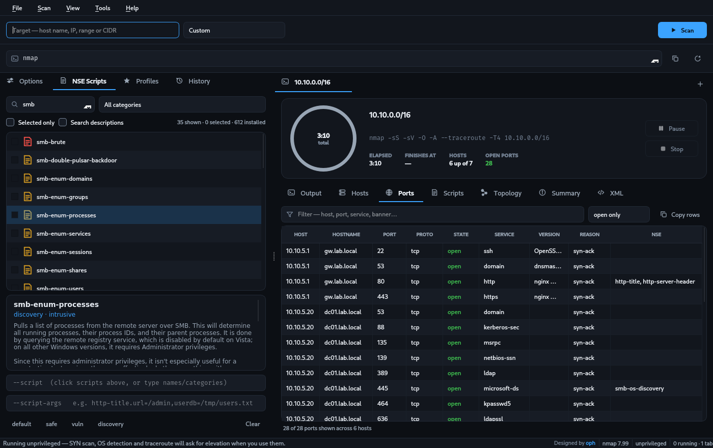

<div align="center">


# Nmap Studio

**A complete graphical front-end for nmap.**
Every scan option, live results, and a countdown that tells you when it finishes.

[](#-linux--debian-ubuntu-kali-mint)
[](#-windows-10--11)
[](#)
[](#)
[](LICENSE)
[](../../actions)
[](../../releases)



<sub>A real scan — the ring fills, the countdown ticks down, results appear as nmap finds them.</sub>

<sub>▶ **[Watch the 40-second tour](docs/demo.mp4)**  ·  no scanner needed: open `docs/sample-scan.xml` with <kbd>Ctrl</kbd>+<kbd>O</kbd> to explore a finished scan</sub>

</div>

---

## ⬇️ Install

> **Nothing else to download.** Python, Qt and nmap are already inside the packages.

### 🐧 Linux — Debian, Ubuntu, Kali, Mint

**1.** Download `nmap-studio-bundled_1.0_amd64.deb` from [**Releases**](../../releases)

**2.** Install it:

```bash
sudo apt install ./nmap-studio-bundled_1.0_amd64.deb
```

**3.** Open **Nmap Studio** from your applications menu. Done. 🎉

<details>
<summary>Remove it later</summary>

```bash
sudo apt remove nmap-studio-bundled
```
</details>

---

### 🪟 Windows 10 / 11

**1.** Download `NmapStudio-Setup.exe` from [**Releases**](../../releases)

**2.** Double-click it and press **Next**.

**3.** Open **Nmap Studio** from the Start menu. Done. 🎉

> 💡 **Optional:** for SYN scans (`-sS`), OS detection (`-O`) and traceroute, also install
> [**Npcap**](https://npcap.com), then right-click the shortcut → *Run as administrator*.
> Everything else works without it.

---

### 🍎 macOS / other Linux

<details>
<summary>Click for the commands</summary>

**macOS**

```bash
brew install nmap
pip3 install PyQt6
./nmap-studio
```

**Fedora / Arch / openSUSE**

```bash
sudo dnf install nmap python3-pyqt6      # Fedora
sudo pacman -S nmap python-pyqt6         # Arch
sudo zypper install nmap python3-qt6     # openSUSE

sudo ./packaging/install.sh
```
</details>

---

## 🚀 Your first scan

```
┌─────────────────────────────────────────────────────────┐
│  1. Type a target      scanme.nmap.org                  │
│  2. Pick a profile     Quick scan                       │
│  3. Press  ▶ Scan      (or Ctrl+Enter)                  │
└─────────────────────────────────────────────────────────┘
```

Results appear **while the scan runs** — you never wait for it to end.

---

## ✨ What you get

|  | |
|---|---|
| ⏱️ **A countdown** | The ring shows time left, the phase nmap is in, and the clock time it will finish |
| 🖧 **Live results** | Hosts and ports fill in as nmap finds them |
| 🎛️ **Every nmap option** | All 100 flags, searchable, each one explained |
| 📜 **All NSE scripts** | 600+ scripts with their docs, filtered by category and risk |
| 🗺️ **Topology map** | A picture of the network, drawn from traceroute |
| 📚 **Scan history** | Every scan saved — reopen it, or compare two runs |
| 📤 **Reports** | Export to HTML, CSV, JSON, Markdown or nmap XML |
| 🌓 **Light & dark** | Switch instantly, no restart |

---

## 📸 Look inside

<div align="center">

**While it runs — the countdown, and results filling in**


**Hosts — every port, service and version**


**Summary — what the scan found, at a glance**


**Topology — the network, drawn from traceroute**


**NSE scripts — all 600+, with their documentation**


</div>

---

## ⌨️ Shortcuts

| Key | Does |
|---|---|
| `Ctrl` + `Enter` | Run the scan |
| `Ctrl` + `.` | Stop it |
| `Ctrl` + `P` | Pause / resume |
| `Ctrl` + `T` | New scan tab |
| `Ctrl` + `O` | Open an nmap XML file |
| `Ctrl` + `B` | Show / hide the options panel |
| `F1` | All shortcuts |

---

## 🔒 Before you scan

Scan only machines you own, or have **written permission** to test.
`scanme.nmap.org` is provided by the Nmap project for practice.

---

## 📖 More

| | |
|---|---|
| 📘 **[Technical documentation](docs/TECHNICAL.md)** | Architecture, every module, how a scan runs, the design system |
| 🔨 **[Building the packages](docs/TECHNICAL.md#13-building-the-packages)** | One command each for the `.deb`, the Windows installer and the single-file builds |
| 🤝 **[Contributing](CONTRIBUTING.md)** | How the code is laid out and what to run before a pull request |
| 🔐 **[Security policy](SECURITY.md)** | How to report a vulnerability privately |
| 📝 **[Changelog](CHANGELOG.md)** | What is in this release |
| ⚖️ **[Third-party notices](NOTICE.md)** | nmap, Npcap and Qt licensing |

---

<div align="center">

Designed and built by **[oph](https://github.com/op-h)**

<sub>Nmap Studio is a front-end. nmap itself is by Gordon Lyon and the Nmap project.</sub>

</div>
